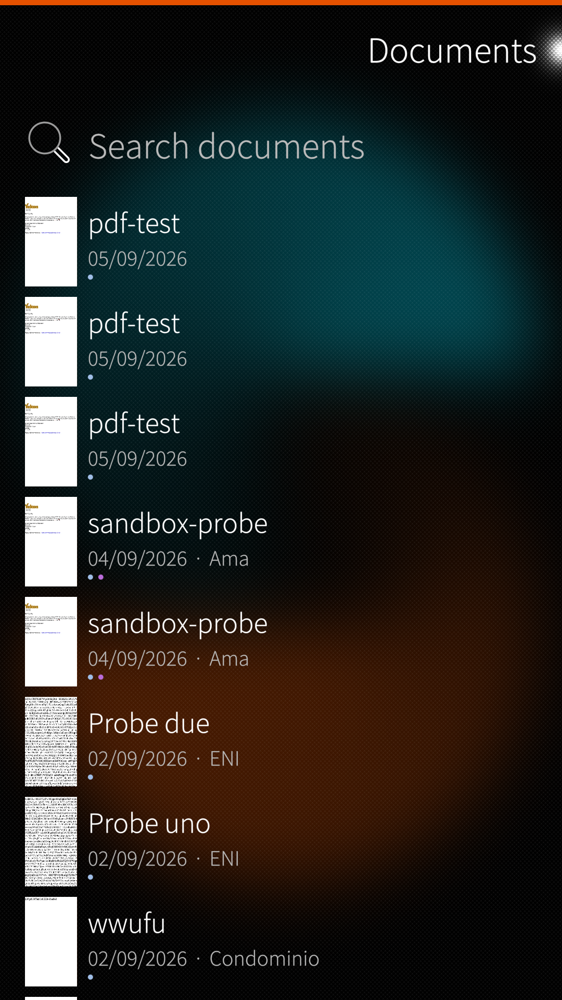
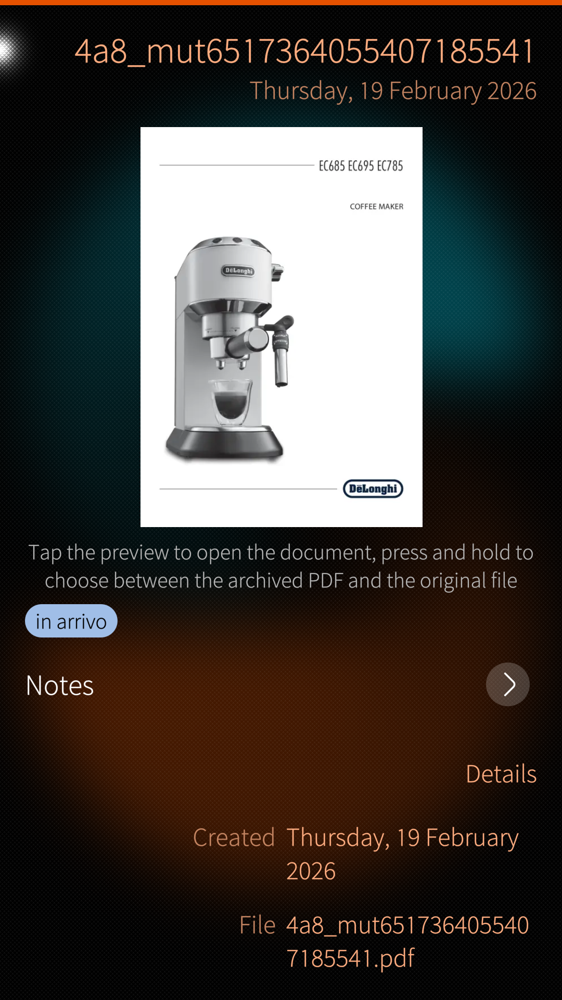
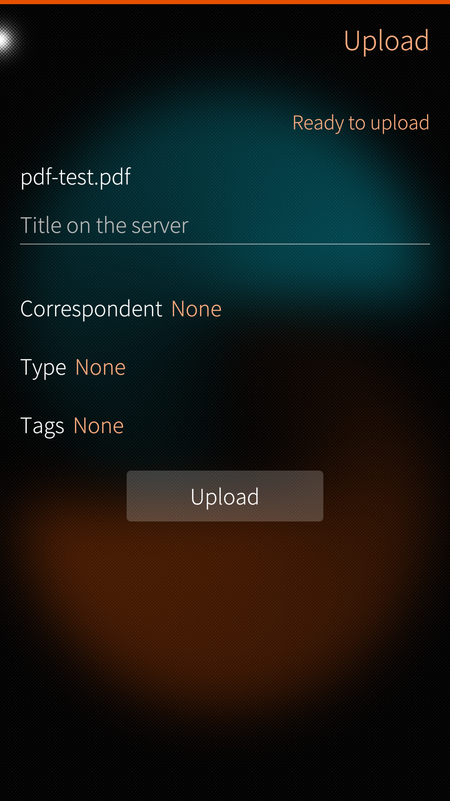

# Paperiton

Paperiton is a native [Paperless-ngx](https://docs.paperless-ngx.com/) client for Sailfish OS. It talks to a Paperless-ngx server that you already run; it does not host documents on the phone.

  

## Donate

The SailfishOS Community Team is on Liberapay:

## Features

<!-- Add screenshots to docs/screenshots/ and uncomment:
  
 
-->

- Sign in with user name and password or with an API token.
- Document view with tags, correspondent, document type, archive serial number and the OCR text.
- Edit title, correspondent, type, tags, date, archive serial number and custom fields; change several documents at once; read, write and delete notes.
- Upload files from the device and from the camera.

## Requirements

- Sailfish OS 5.0 or newer
- A reachable Paperless-ngx instance, API version 9 or newer

## Using Paperiton

[Using Paperiton](docs/guide.md) - signing in, browsing and searching, editing, uploading, and where your files live.

## Download

RPMs are attached to the [GitHub releases](https://github.com/fravaccaro/harbour-paperiton/releases/latest) and [OpenRepos](https://openrepos.net/content/fravaccaro/paperiton-paperless-ngx-client).

## Developers

[Developers](docs/devel/) - architecture, building, deploying, and CI (maintainers and contributors).

## Translate

Request a new language or contribute on the [Transifex project page](https://explore.transifex.com/fravaccaro/paperiton).

## Credits

- [Paperless-ngx](https://docs.paperless-ngx.com/), the document management system this app is a client for.
- [Opal](https://github.com/Pretty-SFOS/opal) QML modules (About, SupportMe) by [Mirian Margiani](https://github.com/Pretty-SFOS/opal-about).
- Thanks to all translators and testers.

## AI disclosure

- **Cursor-assisted work.** Paperiton is developed with [Cursor](https://cursor.com) as an IDE with AI assistance, for tasks such as scaffolding, documentation, translation upkeep and RPM packaging. Output is reviewed and edited by the maintainer before commit.
- **Not a substitute for testing.** AI suggestions do not replace testing on Sailfish OS hardware, reading the code, or applying your own knowledge. Generated changes are treated like any other patch: understand it, test it, then ship it.

## Licence

[GPL-3.0-only](https://github.com/fravaccaro/harbour-paperiton/blob/main/LICENSE)
